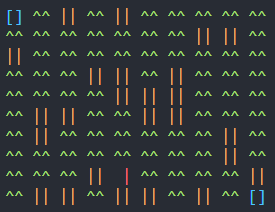

# Python-Maze-Solver
Algorithm in python to solve mazes always exploring with a wall to the right
The code includes a simulation and a simple maze generator with a threshold to decide which cells are free and which not.
## USAGE
```
py mazeStack dimension[optional] timeDelay[optional]
'py mazeStack' will run with the default 5x5 maze
```
## SIMULATION
Each character color has a meaning:
- Green: Free cell
- Yellow: Wall
- Blue: Start/End
- Red: Character


